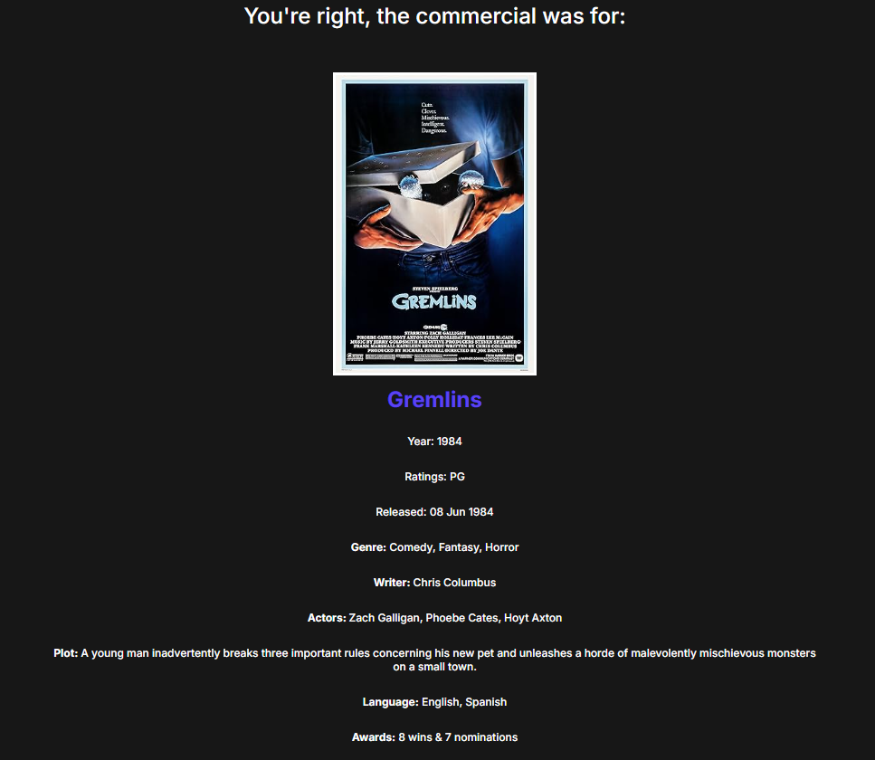

# **Commercile**

Browser guessing game for movie and game commercials.

## **Description**

Commercile is a locally run website that has users guess what movie or game is being advertised in a commercial that's been edited to remove all names or recognizable images. 
This project uses HTML, CSS, JavaScript, the Open Movie Database API (OMDB), the Internet Game Database API (IGDB), and AWS' Secrets Manager and API Gateway
for a proxy server used for fetching IGBD. Created to replicate the layout and features of other daily browser games. 

## **Table of Contents**

- [Installation](#installation)
- [Usage](#usage)
- [Features](#features)
- [Reasources](#reasources)
- [Known issues and future development](#known-issues-and-future-development)
- [License](#license)

## **Installation**

To install Commercile, follow these steps:

1. Clone the repository: **[`git clone https://github.com/username/project-title.git`](https://github.com/Thomas-Curran-Projects/Commercile.git)**
2. Navigate to the project directory: **`cd Commercile`**
3. Install dependencies: **`npm install`**
4. Get an OMDB API key: **[OMDB API key request](https://www.omdbapi.com/apikey.aspx)**
5. Get a client secret & id for IGDB: **[IGDB account creation](https://api-docs.igdb.com/#account-creation)**
6. Follow 'Stack Setup' to create a proxy server for IGDB: **[IGDB proxy server](https://api-docs.igdb.com/#proxy)**
7. In your proxy navigate to Reasourses -> Post -> Integration request -> click edit -> HTTP headers
8. Add the headers Authorization mapped to stageVariables.token, Client-ID mapped to stageVariables.clientid, and Access-Control-Allow-Origin mapped to '*'
9. Create a file called env.js inside the js folder, then add the functions shown in the image: 
10. (Optional) Install eslint and prettier extentions for linting/formatting
11. Install an extention that can host html files locally, or install Node.js and run : **`npm install -g serve`**
12. For an extention, follow their directions to host one of the HTML pages
13. For Node.js, navigate to the project directory with **`cd Commercile`** then run **`serve html/file-name`**

## **Usage**

To use Commercile, follow these steps:

1. Open the project a code editor.
2. Modify the source code to fit your needs.
3. Use an extention or Node.js to host an HTML file.

Demo Video:

## **Features**

1. Search bar with dropdown suggestions

    
  

2. Hints and results screen from OMDB and IGDB data

   
  

3. Tooltips 

  
  

4. Pop-up warnings 

  
 

## **Reasources**

Here are some helpful links and videos:

- **[`OMDB homepage`](https://www.omdbapi.com/)**
- **[`IGDB homepage`](https://www.igdb.com/)**
- **[`Eslint Documentation`](https://eslint.org/docs/latest/)**
- **[`Prettier Documentation`](https://prettier.io/docs/en/)**
- **[`Eslint setup`](https://www.youtube.com/watch?v=eieTlMwCwWU&t=463s)**
- **[`Prettier setup`](https://www.youtube.com/watch?v=_fzbg6_-JuE)**
- **[`Getting Eslint & Prettier working together`](https://www.youtube.com/watch?v=IRdPRIPd9FM)**

## **Known issues and future development**

Issues:

1. Poster images for the games page are lower resolution then the poster image on the movie page.
2. "Image not found" picture is shown before videos load.
3. Video name reveals the movie/game name.

Future development:

Development on Commercile is currently paused while I work on other projects, but in the future I plan expanding the project to be web hosted instead of locally hosted and be automatically updated every day with different commercials. 

## **License**

Commercile is released under the MIT License. See the **[MIT licensing page](https://tlo.mit.edu/understand-ip/exploring-mit-open-source-license-comprehensive-guide)** for details.

## **Authors and Acknowledgment**

Commercile was created by **[Thomas Curran](https://github.com/ThomasCurran2)**.

## **Changelog**

- **0.1.0:** Initial release
